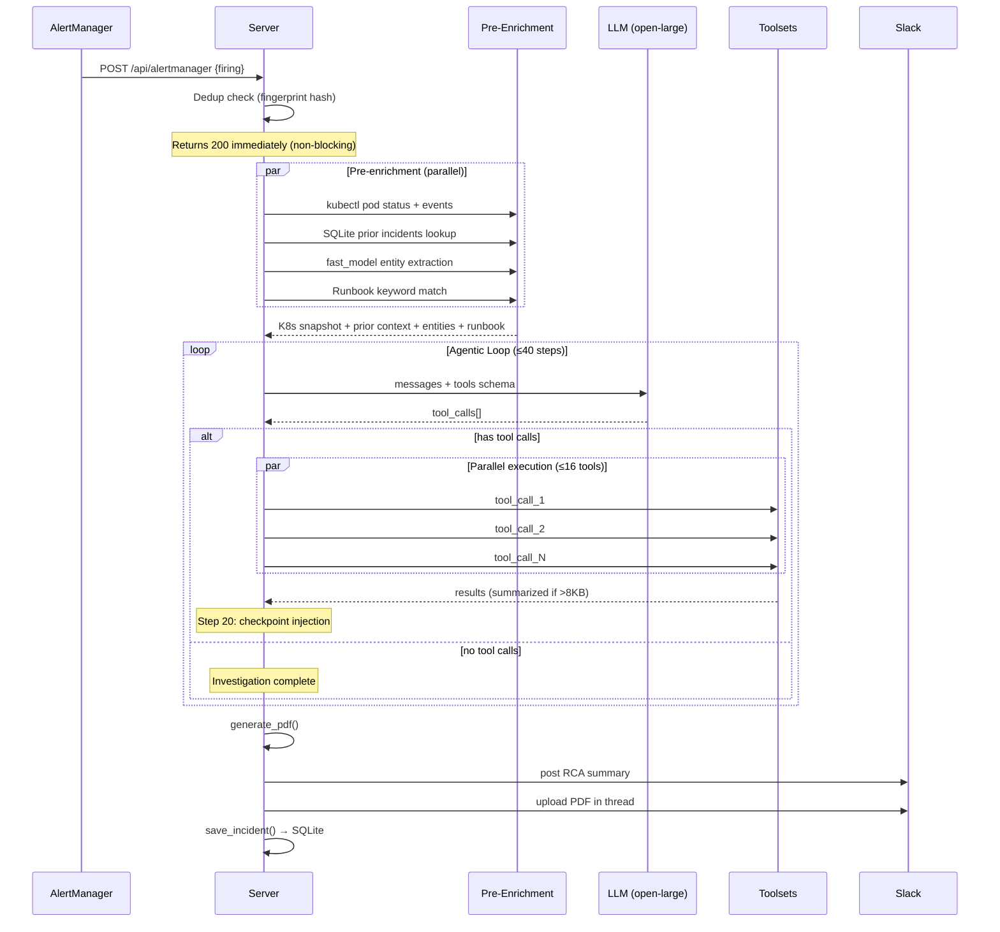
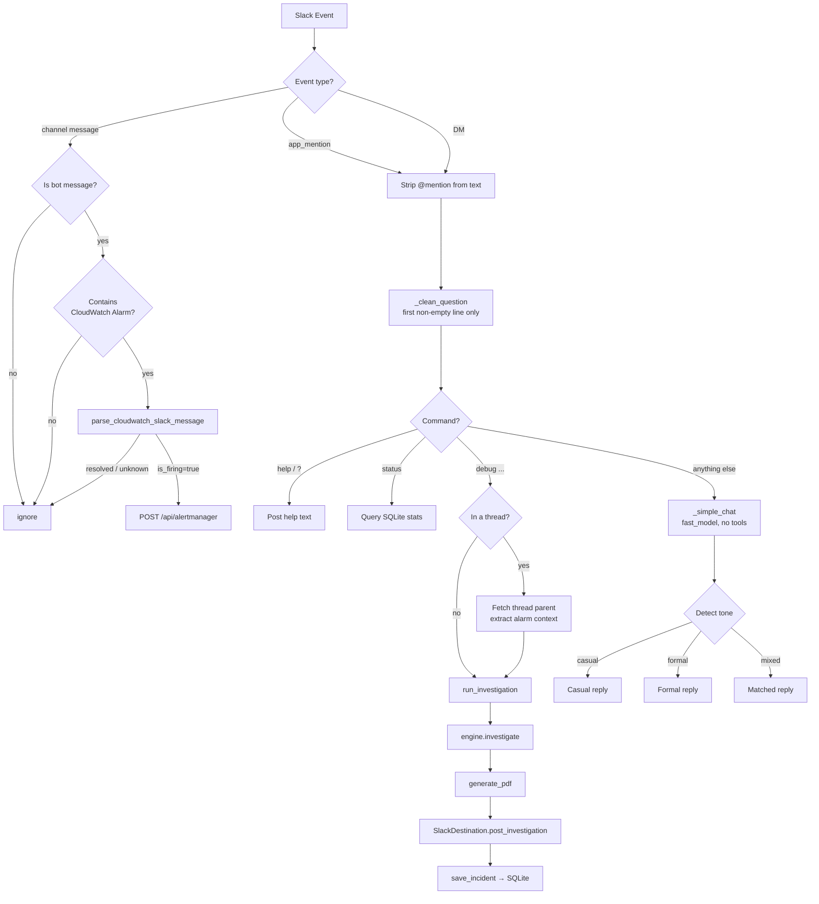
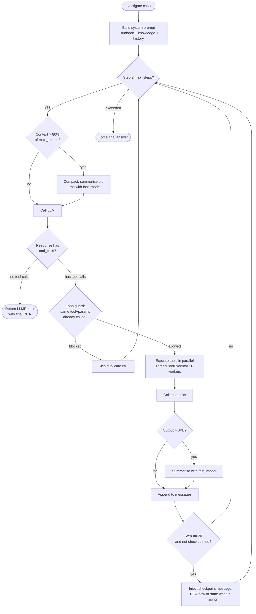
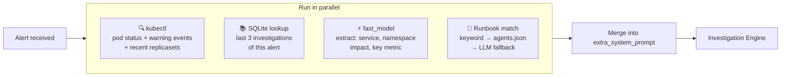
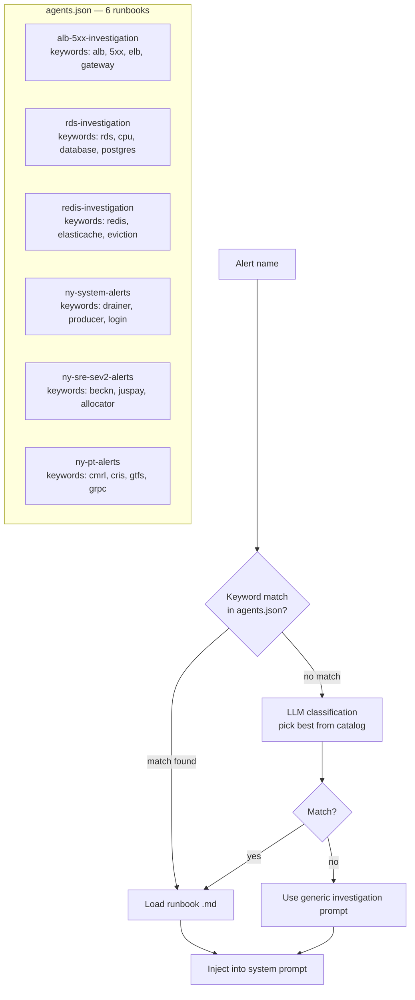
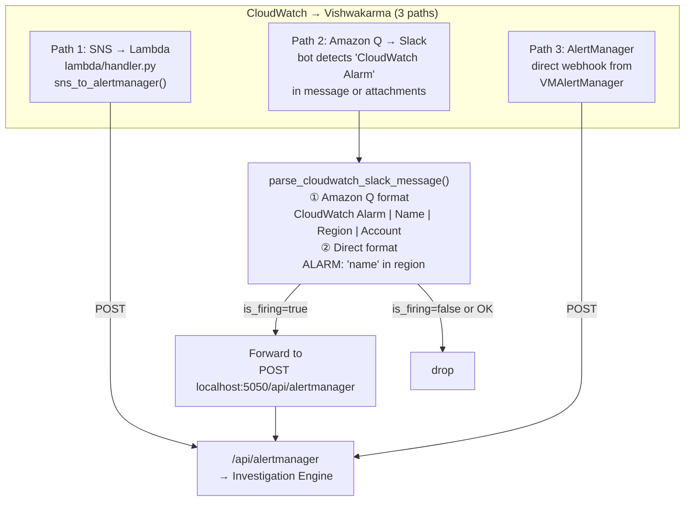
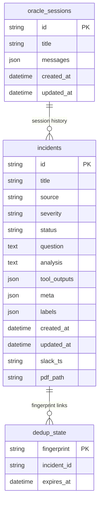

# Vishwakarma

> **Autonomous SRE investigation agent.** Receives alerts, runs a multi-step agentic investigation across your entire observability stack, and posts a structured RCA to Slack with a PDF report — no human needed.

---

## Architecture Overview

```mermaid
graph TB
    subgraph Inputs["🔔 Alert Sources"]
        AM[AlertManager<br/>Webhook]
        CW[CloudWatch<br/>Amazon Q → Slack]
        SNS[CloudWatch SNS<br/>→ Lambda]
        SLACK[Slack<br/>@oogway debug ...]
    end

    subgraph Server["⚡ Vishwakarma Server :5050"]
        API[POST /api/alertmanager]
        DEDUP[Dedup Check<br/>fingerprint hash]
        ENRICH[Pre-Enrichment<br/>4 parallel tasks]
        ENGINE[Investigation Engine<br/>Agentic Loop ≤40 steps]
    end

    subgraph Tools["🛠️ Toolsets"]
        BASH[bash<br/>kubectl · aws · stern]
        PROM[prometheus<br/>VictoriaMetrics]
        ES[elasticsearch<br/>Istio + App logs]
        HTTP[http · internet]
    end

    subgraph Outputs["📤 Outputs"]
        PDF[PDF Report]
        SPOST[Slack Post<br/>RCA + PDF thread]
        DB[(SQLite<br/>/data/vishwakarma.db)]
    end

    AM --> API
    SNS --> API
    CW -->|parse + forward| API
    SLACK -->|direct call| ENGINE

    API --> DEDUP
    DEDUP -->|new alert| ENRICH
    DEDUP -->|duplicate| SKIP[skip]
    ENRICH --> ENGINE

    ENGINE <-->|tool calls| BASH
    ENGINE <-->|tool calls| PROM
    ENGINE <-->|tool calls| ES
    ENGINE <-->|tool calls| HTTP

    ENGINE --> PDF
    ENGINE --> SPOST
    ENGINE --> DB
```

---

## Alert → RCA Flow



---

## Slack Bot Flow



---

## Investigation Engine — Agentic Loop



---

## Pre-Enrichment (Before Every Investigation)



---

## Runbook Matching



---

## CloudWatch Alarm Detection



---

## Data Model & Storage



---

## How It Works

Every investigation follows a structured protocol enforced by the system prompt:

1. **Plan** — `todo_write` with every step before touching any tool
2. **Recon (parallel)** — fire all independent tool calls simultaneously (metrics, logs, K8s events, AWS CLI)
3. **Hypotheses** — state top 3 before running more tools; eliminate with evidence
4. **Five Whys** — drill past symptoms to actual root cause
5. **Checkpoint at step 20** — LLM must decide: write RCA now or state exactly what's still missing
6. **Structured RCA** — Root Cause · Confidence (HIGH/MEDIUM/LOW) · Evidence Chain · Immediate Fix · Prevention

---

## Available Toolsets

Toolsets are enabled/disabled in `config.yaml`. The agent uses only what's enabled.

### Infrastructure

| Toolset | Description |
|---------|-------------|
| `bash` | Run shell commands — `kubectl`, `aws`, `stern`, `jq`, `grep`. Allowlist/blocklist controlled per deployment. Primary tool for K8s and AWS investigation. |
| `kubernetes` | Native K8s API tools (pod status, events, logs). Disabled by default — `bash` with `kubectl` is preferred. |
| `kubernetes_logs` | Fetch pod logs via K8s API. Disabled by default — use `stern` via `bash`. |
| `docker` | Inspect Docker containers, images, logs, and resource usage. |
| `helm` | Inspect Helm releases, chart history, and deployed values. |
| `argocd` | Query ArgoCD application sync status, health, and rollout history. |
| `cilium` | Diagnose Cilium CNI — endpoint health, network policies, Hubble flows. |
| `aks` | Query Azure Kubernetes Service clusters via `az` CLI. |

### Observability & Metrics

| Toolset | Description |
|---------|-------------|
| `prometheus` | Query Prometheus/VictoriaMetrics — instant and range queries. Always use this, never `http_get` for metrics. |
| `grafana` | Query Grafana dashboards, panels, and annotations (also Loki). |
| `datadog` | Query Datadog metrics and monitors. |
| `newrelic` | Query New Relic metrics and alerts. |
| `coralogix` | Search Coralogix logs using DataPrime or Lucene syntax. |

### Logs & Search

| Toolset | Description |
|---------|-------------|
| `elasticsearch` | Search Elasticsearch/OpenSearch logs using Query DSL. Used for app logs, Istio access logs, error traces. |
| `http` | HTTP GET to external URLs. Only for external endpoints — never for internal metrics or logs. |
| `internet` | DNS lookup and basic network diagnostics. |

### Databases & Storage

| Toolset | Description |
|---------|-------------|
| `database` | Run read-only SQL queries against PostgreSQL or MySQL. |
| `mongodb` | Query MongoDB collections (read-only). |
| `kafka` | Inspect Kafka topics, consumer groups, and lag. |

### Integrations

| Toolset | Description |
|---------|-------------|
| `servicenow_tables` | Query ServiceNow incidents and CMDB records. |
| `mcp` | Model Context Protocol — connect to MCP-compatible tool servers. |
| `todo` | Internal task tracker — used by the agent to plan and track investigation steps. |

### Tool Routing Rules

```
Metrics / PromQL  →  prometheus_query or prometheus_query_range  (NEVER http_get)
Log search        →  elasticsearch_search or loki_query           (NEVER http_get)
K8s / AWS / CLI   →  bash tool
External URLs     →  http_get
```

---

## Features

- **Runbook routing** — per-alert runbooks matched by keyword, then LLM classification fallback
- **Pre-enrichment** — K8s pod status, warning events, prior incidents, entity extraction all run in parallel before the agentic loop starts
- **Site knowledge base** — `/data/knowledge.md` on PVC, injected into every investigation, no rebuild needed to update
- **Incident history** — SQLite stores all investigations; prior findings for recurring alerts are injected as context
- **Parallel tool execution** — up to 16 tools run simultaneously per step
- **Checkpoint at step 20** — forces LLM to evaluate evidence and write RCA or state what's missing
- **Safeguards** — identical tool+params blocked from re-running; context-aware loop termination
- **Context compaction** — long investigations auto-compact to stay within LLM context window
- **PDF reports** — full RCA with evidence chain uploaded to Slack thread
- **Slack bot** — `@oogway debug <question>` for on-demand investigations; casual questions answered with tone-matching

---

## Setup

### 1. Prerequisites

- Kubernetes cluster with `kubectl` access
- LLM API (OpenAI-compatible — set `api_base` for self-hosted)
- Slack app with Bot Token (`xoxb-`) and App Token (`xapp-`) for Socket Mode
- AWS IRSA or env var credentials for CloudWatch/RDS queries (if using AWS)

### 2. Configure

```bash
cp config.example.yaml config.yaml
```

Key fields:

```yaml
llm:
  model: openai/gpt-4o          # or any OpenAI-compatible model
  api_base: https://...          # omit for OpenAI default
  api_key: sk-...                # or set VK_API_KEY env var
  fast_model: openai/gpt-4o-mini # used for summarisation, entity extraction, compaction

cluster_name: my-cluster         # shown to LLM in every investigation
max_steps: 40                    # max agentic loop iterations
dedup_window: 300                # seconds to suppress duplicate alerts

toolsets:
  prometheus:
    enabled: true
    config:
      url: http://prometheus.monitoring.svc.cluster.local:9090

  elasticsearch:
    enabled: true
    config:
      url: http://elasticsearch.logging.svc.cluster.local:9200

  bash:
    enabled: true
    config:
      allow: [kubectl, aws, stern, jq, grep, awk, head, tail, sort, uniq]
      block: [rm, curl, wget, env, python]
```

### 3. Runbooks

Runbooks are `.md` files in `vishwakarma/plugins/runbooks/`. Each describes how to investigate a specific alert type.

**To add a runbook:**

1. Create `vishwakarma/plugins/runbooks/<category>/<alert-name>.md`

2. Register it in `plugins/agents/agents.json`:
```json
{
  "id": "my-alert-investigation",
  "description": "Investigate MyAlert — what it means and how to diagnose",
  "keywords": ["myalert", "keyword2"],
  "runbook": "../runbooks/<category>/<alert-name>.md"
}
```

**Included runbooks:**

| Runbook | Covers |
|---------|--------|
| `aws/rds-investigation.md` | RDS high CPU, connections, slow queries via Performance Insights |
| `aws/redis-investigation.md` | ElastiCache high CPU, evictions, connection storms |
| `aws/alb-5xx-investigation.md` | ALB 5xx errors — Istio logs → app logs → dependency pivot |
| `custom/ny-system-alerts.md` | Drainer lag, login rate drops, producer failures, config parse errors |
| `custom/ny-sre-sev2-alerts.md` | SEV2: 5xx errors, external gateway failures, ride-to-search ratio |
| `custom/ny-pt-alerts.md` | Public transit API failures, GIMS 5xx, GRPC down, refund spikes |

### 4. Site Knowledge Base

Create `/data/knowledge.md` on your PVC with cluster-specific context for every investigation:

```markdown
## RDS Instances (region: us-east-1)
my-app-writer (writer), my-app-reader-1 (reader) — aurora-postgresql 14

## Alert → Instance Mapping
"my-app-high-cpu" alarm → check my-app-writer AND my-app-reader-1 simultaneously

## Redis Clusters
main-cache — primary app cache
session-cache — user sessions

## Key Services (namespace: default)
api-backend → my-app-writer + main-cache
worker → my-app-writer

## Known IAM Gaps (always fail — skip, don't retry)
aws rds describe-db-clusters → no permission

## Proven Commands
for i in my-app-writer my-app-reader-1; do
  aws cloudwatch get-metric-statistics --namespace AWS/RDS --metric-name CPUUtilization \
    --dimensions Name=DBInstanceIdentifier,Value=$i \
    --start-time START --end-time END --period 300 --statistics Average Maximum \
    --region us-east-1 --output json | jq -r '.Datapoints|sort_by(.Timestamp)[]|"\(.Timestamp): avg=\(.Average|floor)%"'
done
```

Update without rebuilding:
```bash
kubectl cp ./knowledge.md <namespace>/<pod>:/data/knowledge.md
kubectl rollout restart deployment/vishwakarma -n <namespace>
```

### 5. Deploy to Kubernetes

```bash
kubectl apply -f k8s/rbac.yaml        # ServiceAccount + ClusterRole
kubectl apply -f k8s/deployment.yaml  # PVC + ConfigMap + Deployment + Service
```

### 6. Alert Ingestion

**Option A: AlertManager webhook** (Prometheus / VMAlertManager)
```yaml
receivers:
  - name: vishwakarma
    webhook_configs:
      - url: http://vishwakarma.monitoring.svc.cluster.local:5050/api/alertmanager
```

**Option B: CloudWatch → Amazon Q → Slack**

Add the bot to the channel where Amazon Q posts CloudWatch alarms. It auto-detects the alarm format and forwards to the agentic loop.

**Option C: CloudWatch → SNS → Lambda → Vishwakarma**

Deploy the Lambda in `lambda/` — converts SNS CloudWatch events to AlertManager format and POSTs to `/api/alertmanager`.

---

## Directory Structure

```
vishwakarma/
├── core/
│   ├── engine.py          # Agentic loop — tool calling, parallelism, safeguards, checkpointing
│   ├── prompt.py          # System prompt builder (composable sections)
│   ├── tools.py           # Tool definitions + executor
│   ├── toolset_manager.py # Loads, validates, and manages toolsets
│   └── models.py          # Pydantic data models
├── plugins/
│   ├── toolsets/          # bash, prometheus, elasticsearch, grafana, aws, ...
│   ├── runbooks/          # Investigation runbooks (.md) — one per alert type
│   │   ├── aws/           # RDS, ALB, Redis runbooks
│   │   └── custom/        # Your cluster-specific runbooks
│   ├── agents/
│   │   └── agents.json    # Alert → runbook routing catalog
│   ├── channels/
│   │   └── alertmanager/  # AlertManager webhook parser
│   └── relays/
│       └── slack/         # Slack result poster (PDF + thread)
├── bot/
│   ├── slack.py           # Slack Socket Mode bot (@mention handler, CloudWatch detection)
│   ├── cloudwatch.py      # CloudWatch alarm parser (Amazon Q + SNS formats)
│   └── pdf.py             # PDF RCA report generation
├── storage/
│   └── db.py              # SQLite incident storage
├── server.py              # FastAPI server + pre-enrichment + alert routing
└── config.py              # Config loader (YAML + env vars)

k8s/
├── deployment.yaml        # PVC + ConfigMap + Deployment + Service
└── rbac.yaml              # ServiceAccount + ClusterRole + ClusterRoleBinding

lambda/
└── handler.py             # CloudWatch SNS → AlertManager forwarder

knowledge.md               # Gitignored — your site-specific knowledge base
```

---

## API

| Endpoint | Method | Description |
|----------|--------|-------------|
| `/api/alertmanager` | POST | AlertManager/CloudWatch webhook — triggers investigation |
| `/api/investigate` | POST | Ad-hoc investigation (sync, waits for result) |
| `/api/investigate/stream` | POST | Ad-hoc investigation (SSE streaming) |
| `/api/incidents` | GET | List past investigations |
| `/api/incidents/{id}` | GET | Get single investigation with full tool output |
| `/api/stats` | GET | Investigation statistics |
| `/api/toolsets` | GET | List toolset health and enabled status |
| `/healthz` | GET | Liveness probe |
| `/readyz` | GET | Readiness probe |

---

## Adapting for Your Cluster

| What to change | Where |
|----------------|-------|
| LLM provider + model | `config.yaml` → `llm.model`, `llm.api_base` |
| Fast model (summarisation, extraction) | `config.yaml` → `llm.fast_model` |
| Cluster name shown to LLM | `config.yaml` → `cluster_name` |
| Prometheus / ES / Grafana URLs | `config.yaml` → `toolsets.*` |
| Which tools are available | `config.yaml` → `toolsets.*.enabled` |
| Bash allowlist (which CLIs are allowed) | `config.yaml` → `toolsets.bash.config.allow` |
| Investigation workflow for your alerts | `plugins/runbooks/<your-category>/` |
| Alert → runbook routing | `plugins/agents/agents.json` |
| Infra-specific context (instance names, endpoints, mappings) | `/data/knowledge.md` on PVC |
| Slack bot identity + tone | `bot/slack.py` → `_simple_chat` system prompt |
