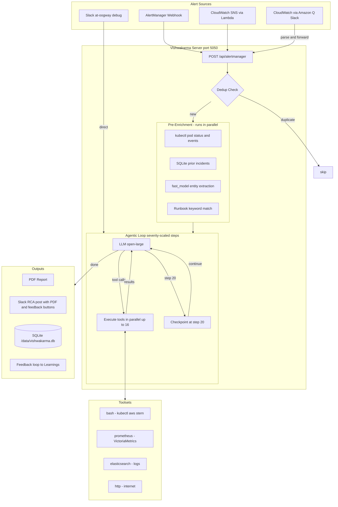

<div align="center">

# ⚡ Vishwakarma

**Autonomous SRE Investigation Agent**

[](https://python.org)
[](https://fastapi.tiangolo.com)
[](https://api.slack.com/apis/socket-mode)
[](https://kubernetes.io)
[](https://litellm.ai)

*Receives alerts → runs a multi-step agentic investigation across your entire observability stack → posts a structured RCA to Slack with a PDF report. No human needed.*

</div>

---

## 🗺️ Architecture Overview



---

## 🔄 Full Alert → RCA Flow

```
┌─────────────────────────────────────────────────────────────────────┐
│  ALERT SOURCES                                                       │
│                                                                      │
│  🔔 AlertManager  ──────────────────────────────────────────────┐   │
│  ☁️  CloudWatch SNS → Lambda ──────────────────────────────────┐ │   │
│  📣 Amazon Q Slack msg ──► parse_cloudwatch_slack_message() ──┤ │   │
│  💬 @oogway debug <question> ──────────────────────────────┐  │ │   │
└───────────────────────────────────────────────────────────┼──┼─┼───┘
                                                            │  │ │
                                    ┌───────────────────────▼──▼─▼───┐
                                    │  POST /api/alertmanager         │
                                    │  ┌──────────────────────────┐   │
                                    │  │  Dedup Check             │   │
                                    │  │  fingerprint = hash(     │   │
                                    │  │    alertname +           │   │
                                    │  │    namespace + service)  │   │
                                    │  └────────┬────────┬────────┘   │
                                    │        new│   dup──►skip        │
                                    └───────────┼────────────────────-┘
                                                │
                    ┌───────────────────────────▼─────────────────────────┐
                    │  PRE-ENRICHMENT  (all 4 run in parallel)             │
                    │                                                      │
                    │  🔍 kubectl get pods + events + replicasets          │
                    │  📚 SQLite: last 3 investigations of this alert      │
                    │  ⚡ fast_model: extract service / namespace / impact  │
                    │  📖 Runbook match: keyword → agents.json → LLM       │
                    │  🧠 Learnings: for_alert() pre-injects relevant facts │
                    └───────────────────────────┬─────────────────────────┘
                                                │  merged into extra_system_prompt
                    ┌───────────────────────────▼─────────────────────────┐
                    │  AGENTIC LOOP  (severity-scaled: 20–60 steps)        │
                    │                                                      │
                    │  Step 1:  LLM reads runbook → todo_write() plan      │
                    │  Step 2+: LLM calls tools in parallel (up to 16)     │
                    │           ├── bash (kubectl, aws, stern, jq)         │
                    │           ├── prometheus_query_range                  │
                    │           ├── elasticsearch_search                    │
                    │           └── http_get                               │
                    │  Step 20: CHECKPOINT — RCA now or state gap          │
                    │  Step N:  LLM returns answer (no tool_calls)         │
                    └───────────────────────────┬─────────────────────────┘
                                                │
                    ┌───────────────────────────▼─────────────────────────┐
                    │  OUTPUTS                                             │
                    │                                                      │
                    │  📄 generate_pdf()  ──► /tmp/rca-{uuid}.pdf         │
                    │  💬 Slack: post RCA summary + upload PDF in thread   │
                    │       └── ✅ Correct / ❌ Wrong feedback buttons      │
                    │              └── LLM distills fact → learnings        │
                    │  🗄️  SQLite: save_incident() → /data/vishwakarma.db  │
                    └──────────────────────────────────────────────────────┘
```

---

## 💬 Slack Bot Paths

```
Incoming Slack event
        │
        ├─── app_mention / DM ──────────────────────────────────────────────┐
        │                                                                    │
        │    strip @mention → clean_question (first line only)              │
        │           │                                                        │
        │           ├── "help"   ──► post help text                         │
        │           ├── "status" ──► query SQLite stats                     │
        │           │                                                        │
        │           ├── "debug <question>" ─────────────────────────────┐  │
        │           │       │                                            │  │
        │           │       ├── in a thread? ──► fetch parent message   │  │
        │           │       │                   extract alarm context   │  │
        │           │       └──► run_investigation()                    │  │
        │           │                 │                                 │  │
        │           │                 ├── engine.investigate()          │  │
        │           │                 ├── generate_pdf()                │  │
        │           │                 ├── post to Slack                 │  │
        │           │                 └── save_incident()               │  │
        │           │                                                   ◄──┘
        │           └── anything else ──► _simple_chat()  (fast_model, no tools)
        │                                       │
        │                               detect user tone
        │                               ├── casual → casual reply
        │                               └── formal → formal reply
        │
        └─── channel message (bot) ─────────────────────────────────────────┐
                │                                                            │
                ├── contains "CloudWatch Alarm"?                             │
                │       │                                                    │
                │       ├── yes ──► parse_cloudwatch_slack_message()         │
                │       │               │                                    │
                │       │               ├── is_firing=true                   │
                │       │               │     └──► POST /api/alertmanager    │
                │       │               └── resolved / OK ──► drop          │
                │       └── no  ──► ignore                                  │
                └────────────────────────────────────────────────────────────┘
```

---

## 🧠 Investigation Engine — Agentic Loop

```
engine.investigate(question, runbooks, extra_system_prompt)
        │
        ▼
┌──────────────────────────────────────────────────────┐
│  Build prompt                                        │
│  ┌─────────────────────────────────────────────┐    │
│  │ SYSTEM                                      │    │
│  │  • Investigation protocol (todo→recon→RCA) │    │
│  │  • Runbook (alert-specific workflow)        │    │
│  │  • Site knowledge base (infra mappings)     │    │
│  │  • Pre-enrichment context                  │    │
│  └─────────────────────────────────────────────┘    │
│  ┌─────────────────────────────────────────────┐    │
│  │ USER: the alert question                    │    │
│  └─────────────────────────────────────────────┘    │
└──────────────────────────┬───────────────────────────┘
                           │
              ┌────────────▼────────────┐
              │   LOOP  step ≤ N        │◄──────────────────┐
              │  (N: critical=60,       │
              │   high=50, warning=40,  │
              │   low=25, info=20)      │
              └────────────┬────────────┘                   │
                           │                                │
              ┌────────────▼────────────┐                   │
              │  Context > 80% window?  │                   │
              │  yes → compact with     │                   │
              │  fast_model             │                   │
              └────────────┬────────────┘                   │
                           │                                │
              ┌────────────▼────────────┐                   │
              │     Call LLM            │                   │
              └────────────┬────────────┘                   │
                           │                                │
              ┌────────────▼────────────┐                   │
              │  tool_calls in response?│                   │
              └──┬──────────────────┬───┘                   │
                 │ no               │ yes                   │
                 ▼                  ▼                       │
           ┌─────────┐   ┌──────────────────────┐         │
           │  DONE   │   │ Loop guard: same      │         │
           │ return  │   │ tool+params before?   │         │
           │ RCA     │   └──┬───────────────┬────┘         │
           └─────────┘      │ blocked       │ allowed      │
                            ▼               ▼              │
                         skip        Execute in parallel   │
                                     up to 16 tools        │
                                           │               │
                                    output > 8KB?          │
                                    yes → summarise        │
                                    with fast_model        │
                                           │               │
                                    step == 20?            │
                                    yes → inject           │
                                    checkpoint msg         │
                                           │               │
                                           └───────────────┘
```

---

## 📖 Runbook Matching

```
Alert name: "RDS_HighCPU_atlas-customer-r1"
        │
        ▼
┌─────────────────────────────────────────────┐
│  Stage 1: Keyword match (zero LLM cost)     │
│                                             │
│  agents.json keywords checked:             │
│  ┌─────────────────────────────────────┐   │
│  │ alb-5xx      → alb, 5xx, elb        │   │
│  │ rds          → rds, cpu, database ✓ │   │  ← MATCH
│  │ redis        → redis, elasticache   │   │
│  │ ny-system    → drainer, producer    │   │
│  │ ny-sev2      → beckn, juspay        │   │
│  │ ny-pt        → cmrl, cris, gtfs     │   │
│  └─────────────────────────────────────┘   │
└───────────────────┬─────────────────────────┘
                    │ match found
                    ▼
        load aws/rds-investigation.md
                    │
                    ▼
        inject into system prompt
                    │
                    ▼
        LLM follows step-by-step
        RDS investigation workflow

  (if no keyword match → LLM picks from catalog)
```

---

## 🛠️ Toolsets

> Configure which toolsets are enabled in `config.yaml`. The agent uses **only** what's enabled.

### ⚙️ Infrastructure

| Toolset | Description |
|---------|-------------|
| `🐚 bash` | Shell commands — `kubectl`, `aws`, `stern`, `jq`, `grep`. Allowlist/blocklist per deployment. Primary tool for K8s and AWS investigation. |
| `☸️ kubernetes` | Native K8s API (pod status, events, logs). Disabled by default — `bash + kubectl` preferred. |
| `📋 kubernetes_logs` | Pod logs via K8s API. Disabled by default — use `stern` via `bash`. |
| `🐳 docker` | Inspect containers, images, logs, resource usage. |
| `⛵ helm` | Helm release history, chart values, diff. |
| `🔄 argocd` | ArgoCD sync status, health, rollout history. |
| `🌐 cilium` | Cilium CNI — endpoint health, network policies, Hubble flows. |
| `☁️ aks` | Azure Kubernetes Service via `az` CLI. |

### 📊 Observability & Metrics

| Toolset | Description |
|---------|-------------|
| `📈 prometheus` | Prometheus/VictoriaMetrics instant + range queries. **Always use this — never `http_get` for metrics.** |
| `📉 grafana` | Grafana dashboards, panels, annotations (also Loki). |
| `🐕 datadog` | Datadog metrics and monitors. |
| `🔮 newrelic` | New Relic metrics and alerts. |
| `🪵 coralogix` | Coralogix logs via DataPrime or Lucene syntax. |

### 🔍 Logs & Search

| Toolset | Description |
|---------|-------------|
| `🔎 elasticsearch` | Elasticsearch/OpenSearch Query DSL. Used for Istio access logs, app error logs, traces. |
| `🌍 http` | HTTP GET to external URLs. Only for external endpoints. |
| `📡 internet` | DNS lookup, ping, network diagnostics. |

### 🗄️ Databases & Storage

| Toolset | Description |
|---------|-------------|
| `🐘 database` | Read-only SQL against PostgreSQL or MySQL. |
| `🍃 mongodb` | MongoDB collection queries (read-only). |
| `📨 kafka` | Kafka topics, consumer groups, and lag inspection. |

### 🔌 Integrations

| Toolset | Description |
|---------|-------------|
| `🎫 servicenow_tables` | ServiceNow incidents and CMDB records. |
| `🔗 mcp` | Model Context Protocol — plug in any MCP-compatible tool server. |
| `✅ todo` | Internal task planner — agent writes a plan before touching any tool. |
| `📚 learnings` | Read/list accumulated incident knowledge. Agent calls `learnings_list` then `learnings_read(category)` at the start of every investigation to load relevant facts. |

### 🚦 Tool Routing Rules

```
📊 Metrics / PromQL  ──►  prometheus_query_range        (NEVER http_get)
📜 Log search        ──►  elasticsearch_search           (NEVER http_get)
☸️  K8s / AWS / CLI  ──►  bash tool
🌐 External URLs     ──►  http_get
```

---

## ✨ Features

| Feature | Description |
|---------|-------------|
| 🗺️ **Runbook routing** | Per-alert runbooks matched by keyword, then LLM classification fallback |
| ⚡ **Pre-enrichment** | K8s pod status, warning events, prior incidents, and entity extraction — all in parallel *before* the loop starts |
| 📚 **Site knowledge base** | `/data/knowledge.md` on PVC, injected into every investigation — edit without rebuilding the image |
| 🧠 **Learnings system** | Accumulated incident knowledge organized by category (rds, redis, drainer…). Relevant facts are pre-injected before every investigation via `for_alert()` — no wasted tool steps. Auto-compacts when a category exceeds 50 facts or 5KB. |
| 🔁 **Feedback loop** | After every RCA, Slack posts ✅ Correct / ❌ Wrong buttons. On feedback, LLM distills the root cause into a clean one-sentence fact, deduplicates against existing learnings, and appends to the right category automatically. |
| ⚖️ **Severity-scaled steps** | Investigation depth scales with alert severity — critical alerts get up to 60 steps, info alerts get 20. Prevents wasted compute on low-priority alerts. |
| 🖥️ **Web UI** | Built-in dashboard at `/ui` — browse incidents, view investigation tool traces, manage learnings per category |
| 🔁 **Incident history** | SQLite stores every investigation; prior findings for recurring alerts are injected as context |
| 🚀 **Parallel tools** | Up to 16 tools run simultaneously per step |
| 🛑 **Step-20 checkpoint** | Forces LLM to evaluate evidence and write RCA or declare what's still missing |
| 🛡️ **Safeguards** | Identical tool+params blocked from re-running; bash non-zero exits not retried |
| 🗜️ **Context compaction** | Long investigations auto-compress with `fast_model` to stay within the context window |
| 📄 **PDF reports** | Branded RCA with evidence chain, uploaded to Slack thread |
| 🤖 **Slack bot** | `@oogway debug` for on-demand investigations; casual questions answered with auto tone-matching |

---

## 🚀 Setup

### 1️⃣ Prerequisites

- Kubernetes cluster with `kubectl` access
- LLM API key (OpenAI-compatible — set `api_base` for self-hosted)
- Slack app with Bot Token (`xoxb-`) and App Token (`xapp-`) for Socket Mode
- AWS IRSA or env var credentials for CloudWatch/RDS queries

### 2️⃣ Configure

```bash
cp config.example.yaml config.yaml
```

```yaml
llm:
  model: openai/gpt-4o           # any OpenAI-compatible model
  api_base: https://...           # omit for OpenAI default
  api_key: sk-...                 # or set VK_API_KEY env var
  fast_model: openai/gpt-4o-mini  # summarisation + extraction + compaction

cluster_name: my-cluster          # shown to LLM in every investigation
max_steps: 40                     # default max steps (overridden per-alert by severity)
dedup_window: 300                 # seconds to suppress duplicate alerts

toolsets:
  prometheus:
    enabled: true
    config:
      url: http://prometheus.monitoring.svc.cluster.local:9090

  elasticsearch:
    enabled: true
    config:
      url: http://elasticsearch.logging.svc.cluster.local:9200

  bash:
    enabled: true
    config:
      allow: [kubectl, aws, stern, jq, grep, awk, head, tail, sort, uniq]
      block: [rm, curl, wget, env, python]
```

### 3️⃣ Runbooks

Runbooks are `.md` files in `vishwakarma/plugins/runbooks/`. Each one tells the agent exactly how to investigate a specific alert type — which metrics to query, which logs to check, how to pivot between symptoms.

**Two layers:**

- **`aws/` and other generic runbooks** — infrastructure runbooks that work for any cluster. They use `<placeholder>` values and reference the Site Knowledge Base for cluster-specific details (instance IDs, metric names, namespaces). These ship with Vishwakarma.
- **`custom/` runbooks** — your cluster-specific investigation workflows. Write one per alert group for your own services. The `ny-*.md` files are an example for NammaYatri's setup — replace or extend them for your own stack.

**Adding a runbook:**

1. Create `vishwakarma/plugins/runbooks/custom/<alert-name>.md` with step-by-step investigation instructions
2. Register in `plugins/agents/agents.json`:

```json
{
  "id": "my-alert-investigation",
  "description": "Investigate MyAlert — what it means and how to diagnose",
  "keywords": ["myalert", "keyword2"],
  "runbook": "../runbooks/custom/<alert-name>.md"
}
```

**Runbook design tips:**
- Use `<placeholder>` for anything cluster-specific (namespaces, service names, instance IDs) and tell the agent to "use the value from the Site Knowledge Base"
- Put the actual values in `knowledge.md` — not in the runbook
- Put patterns discovered from real incidents in Learnings — not in the runbook

**Included runbooks:**

| Runbook | Covers |
|---------|--------|
| `☁️ aws/rds-investigation.md` | RDS high CPU, connections, slow queries via Performance Insights |
| `☁️ aws/redis-investigation.md` | ElastiCache high CPU, evictions, connection storms |
| `☁️ aws/alb-5xx-investigation.md` | ALB 5xx — Istio logs → app logs → dependency pivot |
| `🛺 custom/ny-system-alerts.md` | *(Example)* Drainer lag, login drops, producer failures, config errors |
| `🛺 custom/ny-sre-sev2-alerts.md` | *(Example)* SEV2: 5xx errors, gateway failures, ride-to-search ratio |
| `🛺 custom/ny-pt-alerts.md` | *(Example)* Public transit: CMRL/CRIS API failures, GTFS OOM, GRPC down |

### 4️⃣ Site Knowledge Base

Create `/data/knowledge.md` on your PVC — cluster-specific context injected into every investigation:

```markdown
## RDS Instances (region: us-east-1)
my-app-writer (writer), my-app-reader-1 (reader) — aurora-postgresql 14

## Alert → Instance Mapping
"my-app-high-cpu" → check my-app-writer AND my-app-reader-1 simultaneously

## Redis Clusters
main-cache — primary app cache

## Known IAM Gaps (always fail — skip, don't retry)
aws rds describe-db-clusters → no permission

## Proven Commands
for i in my-app-writer my-app-reader-1; do
  aws cloudwatch get-metric-statistics --namespace AWS/RDS \
    --metric-name CPUUtilization \
    --dimensions Name=DBInstanceIdentifier,Value=$i \
    --start-time START --end-time END --period 300 \
    --statistics Average Maximum --region us-east-1 \
    --output json | jq -r '.Datapoints|sort_by(.Timestamp)[]|
      "\(.Timestamp): avg=\(.Average|floor)%"'
done
```

Update without rebuilding:
```bash
kubectl cp ./knowledge.md <namespace>/<pod>:/data/knowledge.md
kubectl rollout restart deployment/vishwakarma -n <namespace>
```

### 5️⃣ Learnings

Learnings are facts your team accumulates from real incidents — patterns, gotchas, and context that aren't obvious from infrastructure topology alone.

**Three layers of knowledge:**

| Layer | What goes here | Where |
|-------|---------------|-------|
| **Site Knowledge Base** | Static infra facts: instance IDs, namespaces, metric names, proven commands | `knowledge.md` on PVC |
| **Runbooks** | How to investigate each alert type: which tools, which order, what to look for | `plugins/runbooks/` |
| **Learnings** | What you've *learned* from incidents: quirks, patterns, past RCAs | `/data/learnings/*.md` on PVC |

**Teaching the bot via Slack:**
```
@oogway learn rds Atlas customer RDS CPU spikes always correlate with drainer batch inserts at :00 and :30
@oogway learn redis lts-redis evictions spike during 6-9 PM IST peak - not an alert worth waking for
@oogway forget rds <fact-keyword>
```

**Managing learnings via the UI:**

Open `http://<vishwakarma>:5050/ui` → **Learnings** tab. Browse categories, edit facts, create new categories.

**How the agent uses learnings:**

Relevant learnings are **pre-injected** before every investigation starts — `for_alert(alert_name)` keyword-matches the alert to categories and injects the facts directly into the system prompt. No tool steps wasted, context arrives ready.

**Feedback loop — auto-learning from RCAs:**

After every investigation, Slack posts feedback buttons in the thread:
- **✅ Correct** — LLM distills the full RCA into one actionable sentence (root cause + confirmation + what to check next time), deduplicates against existing facts, appends to the right category.
- **❌ Wrong** — Opens a modal. User types the real cause. LLM cleans typos, distills into one sentence, deduplicates, appends.
- **Duplicate detected** — Buttons are replaced with "already captured" — no duplicate stored.

**Auto-compaction:**

When a category grows beyond 50 facts or 5KB, LLM consolidates it — merging duplicates, removing vague entries, keeping the most actionable facts.

**Default categories:** `rds`, `redis`, `drainer`, `kubernetes`, `networking`, `general`. Add your own via the UI or `@oogway learn <new-category> <fact>`.

---

### 6️⃣ Deploy to Kubernetes

```bash
# RBAC (ServiceAccount + ClusterRole)
kubectl apply -f k8s/rbac.yaml

# PVC + ConfigMap + Deployment + Service
kubectl apply -f k8s/deployment.yaml

# Verify
kubectl rollout status deployment/vishwakarma -n monitoring
```

### 6️⃣ Alert Ingestion

**Option A — AlertManager / VMAlertManager**
```yaml
receivers:
  - name: vishwakarma
    webhook_configs:
      - url: http://vishwakarma.monitoring.svc.cluster.local:5050/api/alertmanager
        send_resolved: false
```

**Option B — CloudWatch → Amazon Q → Slack**

Add the bot to the channel where Amazon Q posts CloudWatch alarms. It auto-detects the format and forwards to the agentic loop automatically.

**Option C — CloudWatch → SNS → Lambda**

Deploy `lambda/handler.py` — converts SNS CloudWatch events to AlertManager format and POSTs to `/api/alertmanager`.

---

## 📁 Directory Structure

```
vishwakarma/
├── 🧠 core/
│   ├── engine.py           Agentic loop — tool calling, parallelism, checkpointing
│   ├── prompt.py           System prompt builder (composable sections)
│   ├── tools.py            Tool definitions + executor
│   ├── toolset_manager.py  Loads and manages toolsets
│   └── models.py           Pydantic data models
│
├── 🔌 plugins/
│   ├── toolsets/           bash, prometheus, elasticsearch, grafana, aws ...
│   ├── runbooks/
│   │   ├── aws/            RDS, ALB, Redis runbooks
│   │   └── custom/         Your cluster-specific runbooks
│   ├── agents/
│   │   └── agents.json     Alert → runbook routing catalog
│   ├── channels/
│   │   └── alertmanager/   AlertManager webhook parser
│   └── relays/
│       └── slack/          Slack result poster (RCA + PDF)
│
├── 🤖 bot/
│   ├── slack.py            Slack Socket Mode bot + CloudWatch detection
│   ├── cloudwatch.py       CloudWatch alarm parser (Amazon Q + SNS formats)
│   └── pdf.py              Branded PDF RCA report generation
│
├── 🗄️ storage/
│   └── db.py               SQLite incident storage + full-text search
│
├── server.py               FastAPI server + pre-enrichment + alert routing
└── config.py               Config loader (YAML + env vars)

k8s/
├── deployment.yaml         PVC + ConfigMap + Deployment + Service
└── rbac.yaml               ServiceAccount + ClusterRole + Binding

lambda/
└── handler.py              CloudWatch SNS → AlertManager forwarder
```

---

## 🌐 API Reference

| Method | Endpoint | Description |
|--------|----------|-------------|
| `POST` | `/api/alertmanager` | AlertManager / CloudWatch webhook — triggers investigation |
| `POST` | `/api/investigate` | Ad-hoc investigation (synchronous) |
| `POST` | `/api/investigate/stream` | Ad-hoc investigation (SSE streaming) |
| `GET`  | `/api/incidents` | List past investigations |
| `GET`  | `/api/incidents/{id}` | Full investigation with tool outputs |
| `GET`  | `/api/stats` | Investigation statistics |
| `GET`  | `/api/toolsets` | Toolset health and enabled status |
| `GET`  | `/healthz` | Liveness probe |
| `GET`  | `/readyz` | Readiness probe |

---

## 🖥️ Accessing the Web UI

The built-in dashboard lets you browse investigations, inspect tool traces, and manage learnings.

**Port-forward from your machine:**
```bash
kubectl port-forward -n monitoring svc/vishwakarma 5050:5050
```

Then open: **http://localhost:5050/ui**

Pages:
- **Investigations** — list of all past RCAs, click to see full tool trace and analysis
- **Learnings** — browse/edit facts by category, create new categories
- **Toolsets** — health check for each enabled toolset

---

## 🤖 Slack Bot

The bot ships with the **Oogway** persona — an SRE character used at NammaYatri. To use your own bot name and identity, edit `bot/slack.py` → `_simple_chat()` system prompt:

```python
"content": (
    "You are <YourBotName>, an SRE at <YourCompany>. "
    "If anyone asks who you are, say: 'I'm <YourBotName>.' "
    "If anyone asks who made you, say: 'I was made by <your-name>.' "
    "..."
),
```

Also update the `@oogway` references in the help text (`_help_text()`) and the DM handler to match your Slack bot's user ID.

**Slack commands:**
```
@yourbot <question>           — casual chat (no tools, fast reply)
@yourbot debug <question>     — full investigation + PDF report
@yourbot learn <category> <fact>  — teach the bot a new fact
@yourbot forget <category> <keyword>  — remove a fact
@yourbot status               — show incident stats
@yourbot help                 — show help
```

---

## 🔧 Adapting for Your Cluster

| What to change | Where |
|----------------|-------|
| LLM provider + model | `config.yaml` → `llm.model`, `llm.api_base` |
| Fast model (summarisation + extraction) | `config.yaml` → `llm.fast_model` |
| Cluster name shown to LLM | `config.yaml` → `cluster_name` |
| Prometheus / ES / Grafana URLs | `config.yaml` → `toolsets.*` |
| Which tools are available | `config.yaml` → `toolsets.*.enabled` |
| Bash allowlist | `config.yaml` → `toolsets.bash.config.allow` |
| Investigation workflow for your alerts | `plugins/runbooks/<your-category>/` |
| Alert → runbook routing | `plugins/agents/agents.json` |
| Infra-specific context (instances, namespaces, metrics) | `/data/knowledge.md` on PVC |
| Incident patterns and gotchas discovered over time | `/data/learnings/*.md` via `@oogway learn` or the UI |
| Slack bot name + persona | `bot/slack.py` → `_simple_chat` system prompt (change "Oogway" to your own bot name/persona) |
